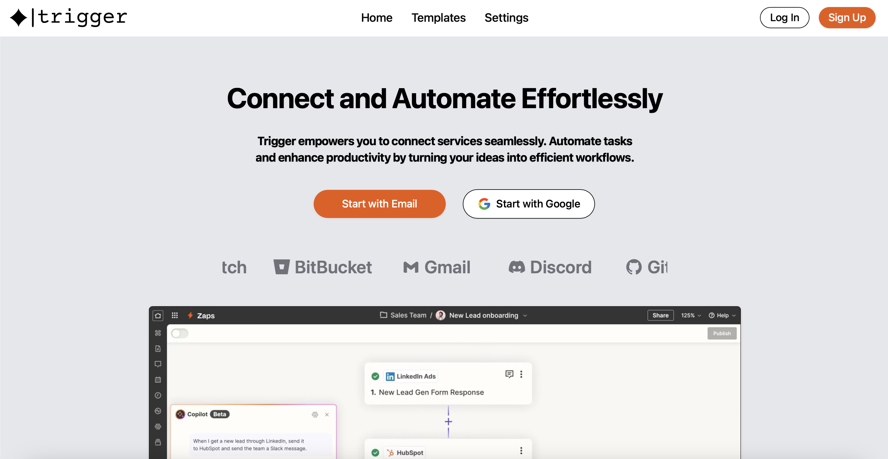

<div align="center">
  
</div>
<br>
<p align="center">
  <a href="https://www.typescriptlang.org/docs/">
  
  </a>
  <a href="https://nextjs.org/docs">
  
  </a>
  <a href="https://react.dev/">
  
  </a>
  <a href="https://go.dev/doc/">
  
  </a>
  <a href="https://docs.docker.com/">
  
  </a>
  <a href="https://www.mongodb.com/docs/">
  
  </a>
</p>


# 📖 Getting Started

This project is designed to **automate** workflows by connecting various apps and services. It enables users to create custom **triggers** and actions, streamlining repetitive tasks and improving **efficiency**.

The platform leverages a *microservices* architecture to ensure scalability and maintainability, with services written in modern technologies like `Go` and `TypeScript`, and a responsive frontend built on `Next.js` and `React`.

## 🔑 Key Features

- Action-Reaction Framework: Create custom workflows by linking triggers (events) from one app to actions in another.

- Integration with Popular Platforms: Connect to apps like Google, GitHub, Discord, Spotify, Twitch, and Bitbucket, among others.

- Secure Authentication: OAuth2-based authentication for seamless and secure integrations.

- Real-time Syncing: Sync data between services with minimal latency.

- Scalable Infrastructure: Built using Docker to handle high traffic and demand.

- Customizable: Define workflows tailored to your specific needs, with fine-grained control over triggers and actions.

## 🖥️ Core Technologies

- Frontend: Next.js and React for a modern, responsive, and user-friendly interface.

- Backend: Microservices written in Go for high performance and scalability.

- Database: MongoDB for flexible and scalable data storage.

- Containerization: Docker ensures consistent deployment across environments.

- Integration: Supports a wide range of third-party services with robust APIs.


## 📝 Prerequisites

### Install Docker
For the **Docker**, you can download it [here](https://go.dev/doc/install) directly or use the command line:

1. Download and Install Docker:

    ``` bash
    sudo apt update
    sudo apt install -y ca-certificates curl gnupg
    
    sudo install -m 0755 -d /etc/apt/keyrings
    curl -fsSL https://download.docker.com/linux/ubuntu/gpg | sudo gpg --dearmor -o /etc/apt/keyrings/docker.gpg
    
    echo \
      "deb [arch=$(dpkg --print-architecture) signed-by=/etc/apt/keyrings/docker.gpg] https://download.docker.com/linux/ubuntu \
      $(lsb_release -cs) stable" | sudo tee /etc/apt/sources.list.d/docker.list > /dev/null
    
    sudo apt update
    sudo apt install -y docker-ce docker-ce-cli containerd.io docker-buildx-plugin docker-compose-plugin
    
    docker --version
    ```

## ⚙️ Installation

1. **Clone the Repository**

    ``` bash
    git clone https://github.com/EpitechPromo2027/B-DEV-500-BAR-5-1-area-alba.candelario-matas.git
    cd app/deploy
    ```
2. **From the deploy folder run the launch script**

    ``` bash
    ./scripts/trigger.sh
    ```

    To verify that all the containers are running, use the command `docker compose logs`, if the containers are running correctly, you should see an output similar to the following:

    ADD IMAGE

# 🌐 Environment Variables

To configure the environment, a `.env` file on the deploy folder.

**environment variables**

``` env
# .env.docker-compose

# mongo

MONGO_INITDB_ROOT_USERNAME=<user>
MONGO_INITDB_ROOT_PASSWORD=<password>
MONGO_PORT=<port>
MONGO_HOST=<host>
MONGO_DB=<name>

# ports

AUTH_PORT=<port>
USER_PORT=<port>
SESSION_PORT=<port>
ACTION_PORT=<port>
GMAIL_PORT=<port>
SYNC_PORT=<port>
SETTINGS_PORT=<port>
GITHUB_PORT=<port>
SPOTIFY_PORT=<port>
TWITCH_PORT=<port>
TIMER_PORT=<port>
DISCORD_PORT=<port>
BITBUCKET_PORT=<port>
WEB_PORT=<port>
MOBILE_PORT=<port>

# urls

WEB_BASE_URL=<url>
AUTH_SERVICE_BASE_URL=<url>
USER_SERVICE_BASE_URL=<url>
SESSION_SERVICE_BASE_URL=<url>
ACTION_SERVICE_BASE_URL=<url>
GMAIL_SERVICE_BASE_URL=<url>
SYNC_SERVICE_BASE_URL=<url>
SETTINGS_SERVICE_BASE_URL=<url>
GITHUB_SERVICE_BASE_URL=<url>
SPOTIFY_SERVICE_BASE_URL=<url>
TWITCH_SERVICE_BASE_URL=<url>
TIMER_SERVICE_BASE_URL=<url>
DISCORD_SERVICE_BASE_URL=<url>
BITBUCKET_SERVICE_BASE_URL=<url>
SERVER_BASE_URL=<url>
NGROK=<url>

# auth

AUTH_KEY=<key>
AUTH_MAX_AGES=<number>
AUTH_IS_PROD=<boolean>
TOKEN_SECRET=<token>
ADMIN_TOKEN=<token>

# google

GOOGLE_CLIENT_ID=<token>
GOOGLE_CLIENT_SECRET=<token>

# github

GITHUB_AUTH_KEY=<key>
GITHUB_SYNC_KEY=<key>

GITHUB_AUTH_SECRET=<token>
GITHUB_SYNC_SECRET=<token>

# discord

DISCORD_KEY=<key>
DISCORD_SECRET=<token>
BOT_TOKEN=<token>

# spotify

SPOTIFY_KEY=<key>
SPOTIFY_SECRET=<token>

# twitch

TWITCH_CLIENT_ID=<key>
TWITCH_CLIENT_SECRET=<token>

# bitbucket

BITBUCKET_AUTH_KEY=<key>
BITBUCKET_SYNC_KEY=<key>
BITBUCKET_AUTH_SECRET=<token>
BITBUCKET_SYNC_SECRET=<token>

```
> For a reference on where to place the `.env` file and how to set it up, see the [example file](/app/deploy/.env.example).

> [!Important]
>
> Ensure you replace the placeholders (`<user>`, `<password>`, `<url>`, etc.) with your actual configuration values. Proper setup of these environment variables is essential for the application to function correctly.

# 🚀 Usage

1. Check all the `.env` files are properly configured with the necesary information. Refer to the [Environment Variables](#-environment-variables) section for details.
2. Ensure **Docker** is up and running. For installation instructions, see the [Installation](#%EF%B8%8F-installation) section.
3. Check if the frontend is correctly set up by viewing the logs:

    ``` bash
    docker compose logs client_web
    ```
4. If the **Frontend** is running correctly, you should see the following on your browser:



# 📜 License

The license can be found [here](./LICENSE)

# 👥 Authors

| [<br><sub>Renzo Maggiori</sub>](https://github.com/RenzoMaggiori) | [<br><sub>Oriol Liñan</sub>](https://github.com/oriollinan) | [<br><sub>Alba Candelario</sub>](https://github.com/AlbaCande) | [<br><sub>Gonzalo Larroya</sub>](https://github.com/G0nzal0zz) | [<br><sub>Diana Andrades</sub>](https://github.com/DianaAndrades)
|:---:|:---:|:---:|:---:|:---:|
