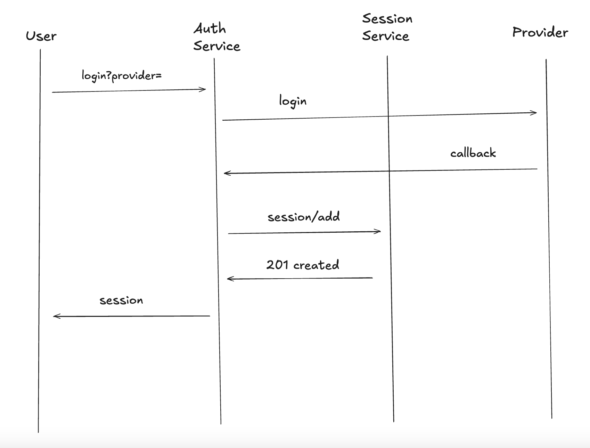
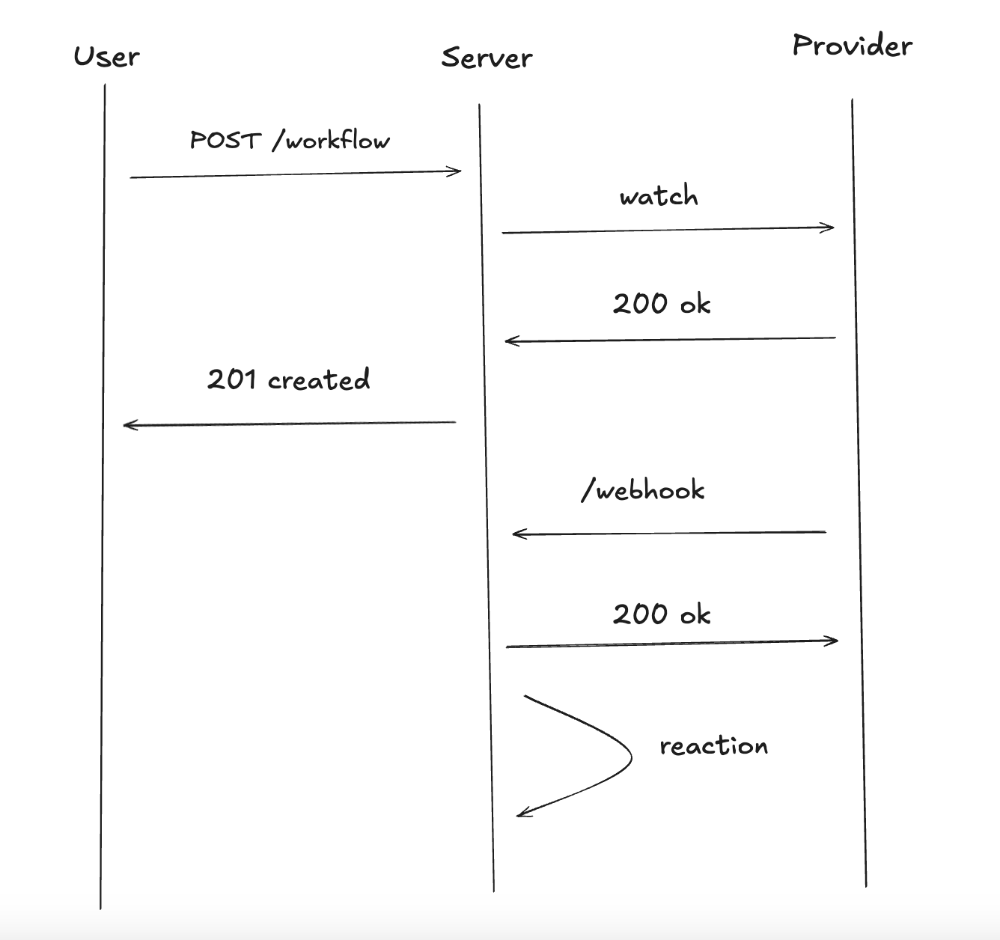

# SERVICES

## Approach

1. **Independence**: Each microservice functions autonomously, managing its own responsibilities without relying on the internal workings of other services.

2. **Scalability**: Services can be individually scaled based on demand, optimizing resource usage.

3. **Maintainability**: Isolated services simplify code management and enable updates without affecting the entire system.

## Services

> **_WARINNG:_**
> - The `base` services should be with **_care_**.
> - If you would like to add more `providers` please read [this](##Provider)

- _Base:_
    - User
    - Session
    - Settings
    - Auth
    - Sync
    - Action
- _Providers:_
    - Gmail
    - Github
    - Spotify
    - Twitch
    - Discord
    - Bitbucket

---

### Adding New Services

1. Please read the [following](./ARCHITECTURE.md)
2. Create a directory with the name of the service in [`cmd`](../cmd) and [`internal`](../internal) directories
3. Create a `main.go` in the new directory in [`cmd`](../cmd), this is the entrypoint of your service
4. Create the interal logic of your server in the [`internal`](../internal) directory
5. If you would like to use or add common functionality please look in the [`pkg`](../pkg) directory

## Provider

### Auth Workflow

> **_NOTE:_**
> To add a new auth provider both the `auth` and `sync` microservices must be _modified_

1. Add your provider to the following files `internal/auth/providers/routes.go` and `internal/sync/routes.go`
    - It should looks something like the following:<br>
    ```go
    CreateProvider(
        PROVIDER.New(
            os.Getenv("PROVIDER_ID"),
            os.Getenv("PROVIDER_SECRET"),
            callback,
            "scopes"
        ),
    )
    ```
2. Add your enviroment variables to the following files `internal/auth/env.go` and `internal/sync/env.go`
3. Finally don't forget to configure the `docker-compose.yml` so it builds correctly

<br>



### Provider Automation

> **_NOTE:_**
> All providers must implement this in order to work with the `action` microservice

```go
type Trigger interface {
	Watch(ctx context.Context, action workspace.ActionNodeModel) error
	Webhook(ctx context.Context) error
	Stop(ctx context.Context) error
}

type Reaction interface {
	Reaction(ctx context.Context, action workspace.ActionNodeModel) error
}
```

> **_NOTE:_**
> Make sure you when you add a new provider that you modify the `docker-compose.yml`

> **_NOTE:_**
> There are 3 ways to handle workflow automation in **Trigger**

1. Webhook (_use this when possible_)
    1. Implement a the `Trigger` and `Reaction` interfaces
    2. The `Watch` should call your provider and request to be notified at `Webhook`
    3. `Stop` should notify your provider to stop the subscription
    4. The `Reaction` will be called internally by the `Action` service
2. Websocket
    1. Set up a worker that listens on a `Socket` for new information
    2. Apply the steps from the `Webhook`
    3. Query the `Action` service to notify your service of new information
3. Polling
    1. Set up a worker on a `Cron Job` and check for new information
    2. Apply the steps from the `Webhook`
    3. Query the `Action` service to notify your service of new information

<br>



